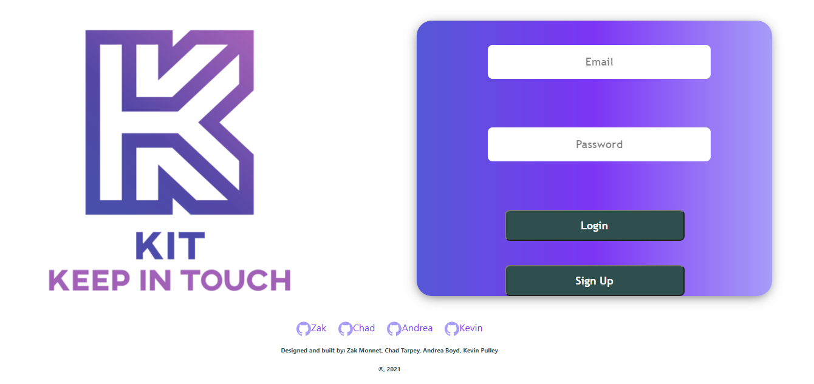

# KIT: Keep in Touch
## Project #3

KIT is a messaging application in which users can create a personal account with the ability to create groups,join existing groups, and invite friends to groups.



See it in action:
[Click Me](https://sheltered-plains-45359.herokuapp.com/)

## USER STORY: 
- WHEN USER creates a KIT profile 
- THEN USER can create groups (KITs), join KITs, and invite friends to KITs in order to send messages 
- WHEN USER has joined a KIT
- THEN USER can create direct messages (Klusters) within each KIT and send private messages to specific groups members

## Installation
From root directory run
```
npm install
```
to install dependencies and then
```
npm start
```
to stand up the server

## Technologies Used: 
- Bootstrap: [Website](https://getbootstrap.com/)
- Material UI: [Website](https://material-ui.com/)
- Mongo DB/ Mongoose: [Website](https://www.mongodb.com/)
- Passport: [Website](http://www.passportjs.org/)
- React: [Website](https://reactjs.org/)
- Socket.io: [Website](https://socket.io/)

## Contributors: 
- Zak Monnet: [Github Profile](https://github.com/outoftune266)
- Chad Tarpey: [Github Profile](https://github.com/chadtarpey615)
- Kevin Pulley: [Github Profile](https://github.com/Kevin-Pulley)
- Andrea Boyd: [Github Profile](https://github.com/Andrea-Boyd)

## License
MIT License
Copyright (c) 2021 Andrea Boyd, Zak Monnet, Kevin Pulley, Chad Tarpey
Permission is hereby granted, free of charge, to any person obtaining a copy
of this software and associated documentation files (the "Software"), to deal
in the Software without restriction, including without limitation the rights
to use, copy, modify, merge, publish, distribute, sublicense, and/or sell
copies of the Software, and to permit persons to whom the Software is
furnished to do so, subject to the following conditions:
The above copyright notice and this permission notice shall be included in all
copies or substantial portions of the Software.
THE SOFTWARE IS PROVIDED "AS IS", WITHOUT WARRANTY OF ANY KIND, EXPRESS OR
IMPLIED, INCLUDING BUT NOT LIMITED TO THE WARRANTIES OF MERCHANTABILITY,
FITNESS FOR A PARTICULAR PURPOSE AND NONINFRINGEMENT. IN NO EVENT SHALL THE
AUTHORS OR COPYRIGHT HOLDERS BE LIABLE FOR ANY CLAIM, DAMAGES OR OTHER
LIABILITY, WHETHER IN AN ACTION OF CONTRACT, TORT OR OTHERWISE, ARISING FROM,
OUT OF OR IN CONNECTION WITH THE SOFTWARE OR THE USE OR OTHER DEALINGS IN THE
SOFTWARE.


